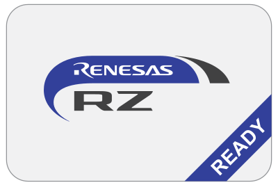

# drp-ai-demo-app
The DRP-AI AI accelerator from Renesas Electronics achieves high performance by performing AI inference as well as pre-processing in hardware.
This repository provides a demonstration application of DRP-AI that can be applied to real-world problems.

| Demonstration application | Architecture | Description |
| --- | --- | --- |
| [Body Measurement](BodyMeasurement/README.md) | [HRNET](https://arxiv.org/pdf/1908.07919) | This application is designed to estimate human pose in captured images from distance data of a depth camera, and display the results such as height on an HDMI screen. |
| [River Level Monitor](RiverLevelMonitor/README.md) | [Deeplabv3](https://arxiv.org/pdf/1706.05587.pdf) | This application is designed to detect river objects in the images captured by the camera and display the flood risk of the river based on its area on the HDMI screen. |
| [PatchCore Demo](PatchCoreDemo/README.md) | [PatchCore](https://arxiv.org/abs/2106.08265) | This application is designed to detect anomalies in camera-captured images and image files and display an abnormality determination and abnormality heat map on the HDMI screen. |

# Setup
To see the install guide, please refer to the [Install guide](installguide.md).

# Contact us
ai.seles@compmind.co.jp

[Computermind corporation](https://www.compmind.co.jp/) is a [Renesas RZ Partner Ecosystem](https://www.renesas.com/us/en/products/microcontrollers-microprocessors/rz-mpus/rz-partner-solutions).

